# Thali Restaurant

Thali Restaurant is a website of a restaurant that provides an online booking system to reserve a table for their customers.
It helps customers to book,add,update and delete bookings through online.

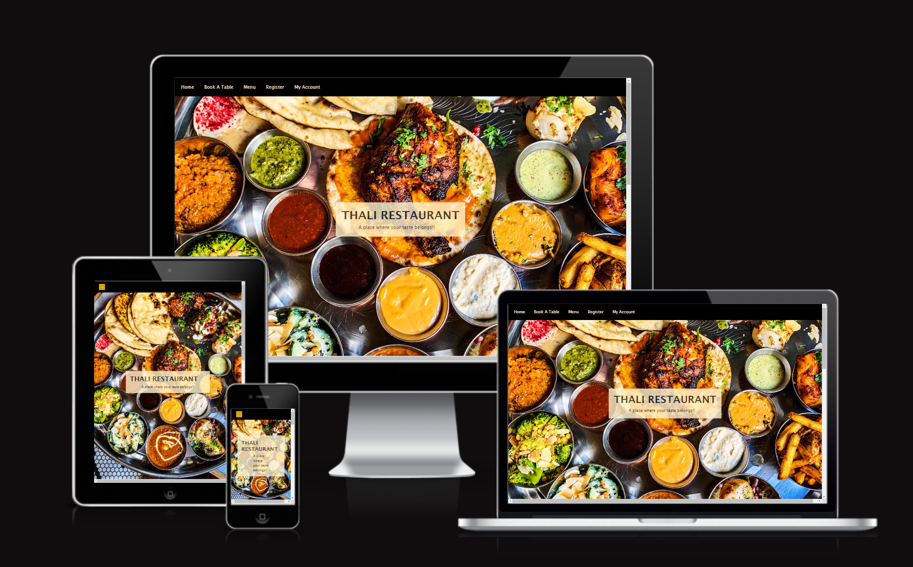

[Live link to website](https://thali-restaurant.herokuapp.com/)

## User Stories

### Registered Users

- As a registered user, I would like to log in to my account, so that I can access the site. `(MUST HAVE)`
- As a registered user, I would like to log out of my account, so that I can end my session on my current device. `(MUST HAVE)`
- As a registered user, I would like to create new bookings, so that I can add time,date,no:of guests and any special requests. `(MUST HAVE)`
- As a registered user, I would like to edit my  bookings in my profile , so that I can further change my bookings. `(MUST HAVE)`
- As a registered user, I would like to delete my bookings, so that I can remove bookings that I no longer want. `(MUST HAVE)`.
- As a registered user,I would like to view my bookings in my account page,so that I can update my booking details.`(MUST HAVE)`.
- As a registered user,I would like to get notification on my email,so that I can have a reminder of my booking.`(COULD HAVE)`.
- As a registered user,I would like to view comments from other users in this hotel,so that I can have an update about the restaurant.`(SHOULD HAVE)`.
- As a registered user I want to be able to put the site into dark mode so that I can make the website easier to see at night. `(WONT HAVE)`.

### Site Admin
- As a site admin,I should be able to view the bookings in the site,so that I can moderate site's content. `(MUST HAVE)`.
- As a site admin,I should be able to delete bookings in the site,so that I can remove unavailable bookings.`(SHOULD HAVE)`.
- As a site admin,I should be able to notify customer of removed bookings through email,so that I can update the user.`(COULD HAVE)`.

## Wireframes

I've used [Balsamiq](https://balsamiq.com/wireframes) to design my site wireframes.

### Home Page Wireframe

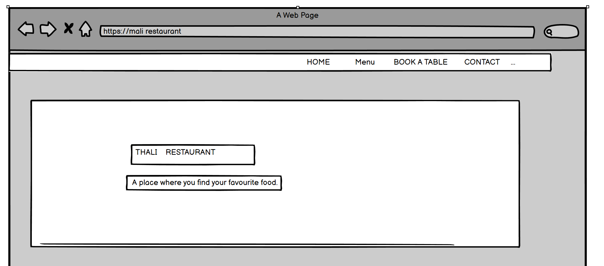

### Booking page Wireframe

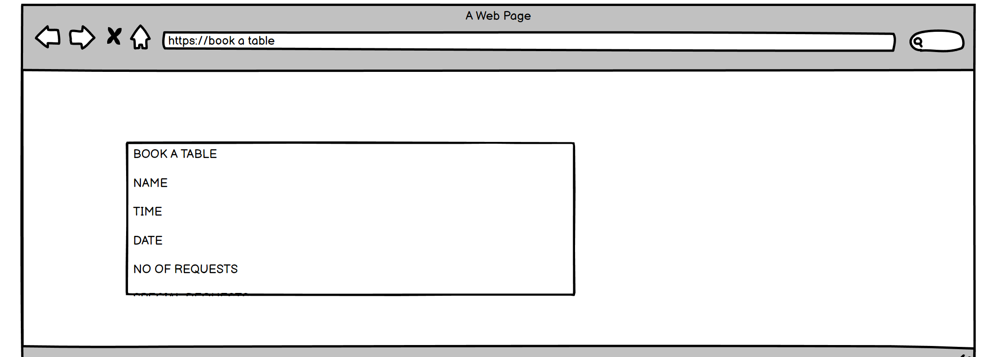

###  Menu page Wireframe

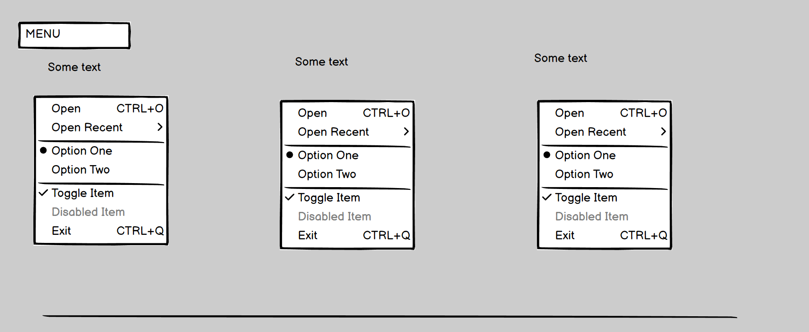

## Features

### Existing Features

#### Home Page
- The home page represents the name of the restaurant.It has a navbar with home,book a table,register,my account icons.

- The navbar icons toggle down when page is responsive.
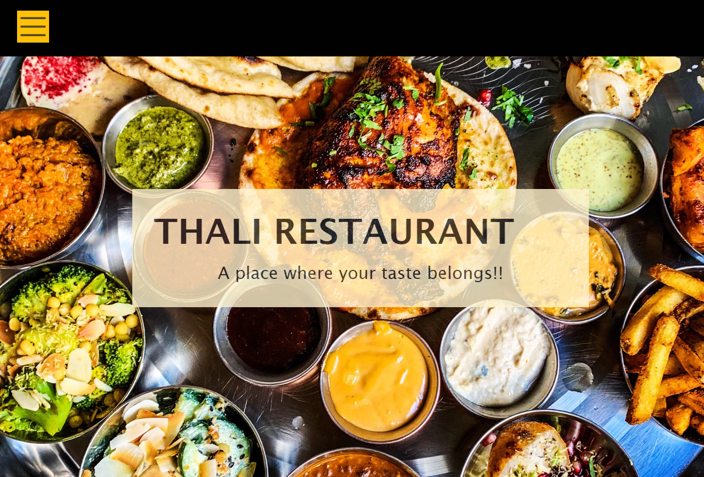

- when scrolling down,there is the story of the restaurant.
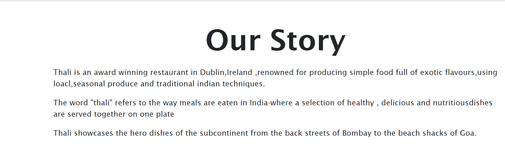

- Further down in the page, there is the available timings for the booking schedule.
- There is a book a table button.It takes the user to the booking page where user can book a table.
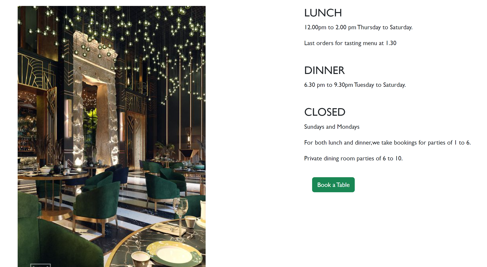

#### Menu Page

-The user can view the menu in this page after clicking the menu button in the menu bar.
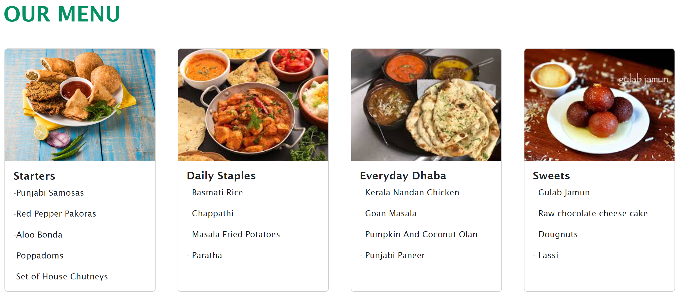

#### Login Page

- when user clicks the book a table button in the navbar,the user is taken to a login page.

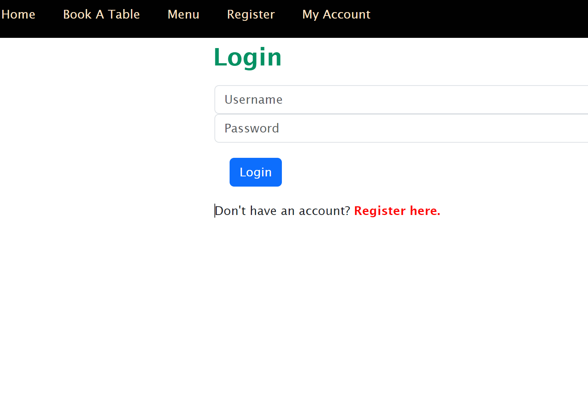

- If the user is already registered,the user has to just type username and password.
- And clicks the login button.The user is taken to booking page.

#### Booking Page

- The user can type in the date,phone number, time and special requests.
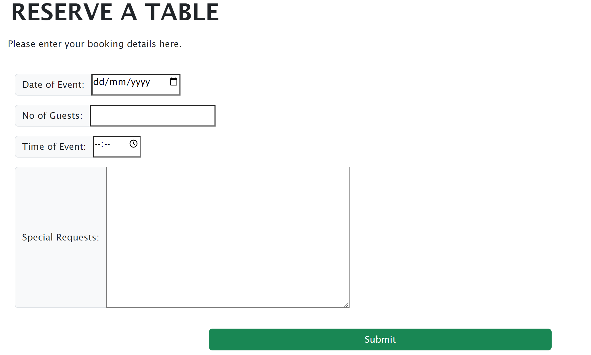
- the user can click submit button if user fills all columns.
- If user didnt fill all columns,the validation message will be shown.
- The user is taken to the my account page.

#### My account Page
- The user gets all the pre booking details in this web page.
- The user can edit or delete the bookings already done.

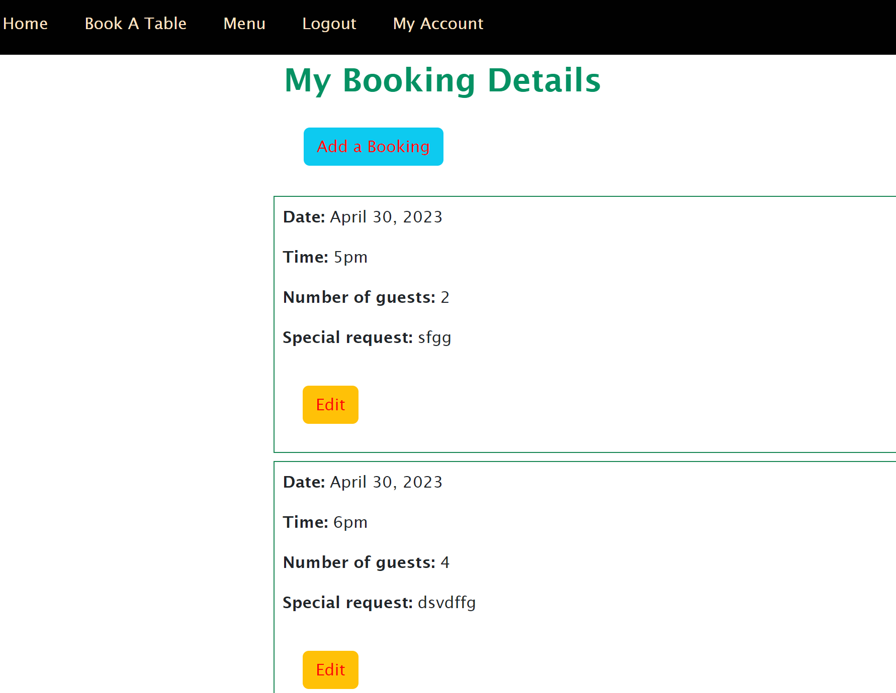
- If user clicks delete button,the booking is deleted.

#### Edit Page
- when user clicks the edit button in the my account page,the user is taken to edit page.
- The user can edit any changes in this page.

- when user updates the changes, the usergets the message that its updated successfully.

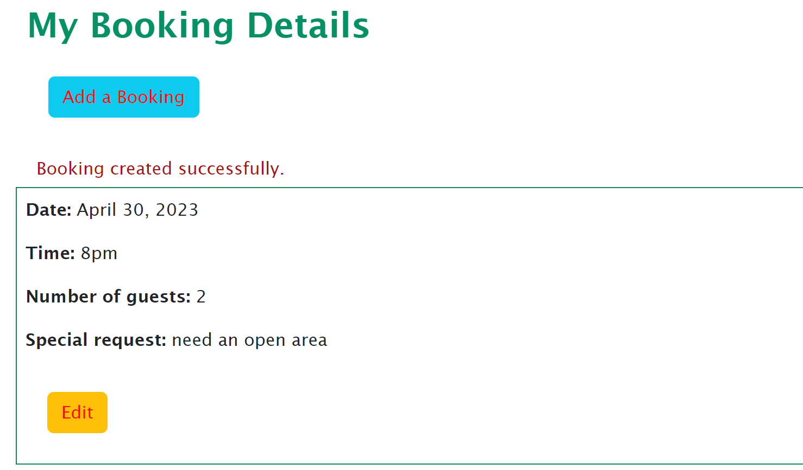

#### Error Message

- The user gets an error message, if the bookings are done my same time or date or by two different persons at the same date and time.

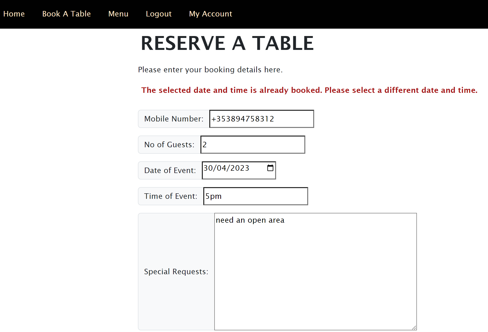

## Features Left to Implement

- In future,this website may add more features such as a user recieves a confirmation message through email when booking is done.
- Also when the booking is cancelled,the user gets notification in email and phone.
- The user will be able to select the menu online while booking for a table.
- The user could be able to pay online after booking table.

## Typography and Color scheme

- The font used in this website is  'Lucida Sans' font family [Google fonts](https://fonts.google.com).
- The background color for the main page is an image of Thali..
- The color scheme used is mainly  #ffe4c4 and success.A yellow -green combination.
- The user is aware of the error messages by highlighting in red color.

## Technology
The technology used in this website is :
- [HTML](https://en.wikipedia.org/wiki/HTML) used for the main site content.
- [CSS](https://en.wikipedia.org/wiki/CSS) used for the main site design and layout.
- [Bootstrap](https://getbootstrap.com) used as the front-end CSS framework for modern responsiveness and pre-built components.
- [Python](https://www.python.org) used as the back-end programming language.
- [Git](https://git-scm.com) used for version control. (`git add`, `git commit`, `git push`)
- [GitHub](https://github.com) used for secure online code storage.
- [Gitpod](https://gitpod.io) used as a cloud-based IDE for development.
- [Markdown Builder by Tim Nelson](https://traveltimn.github.io/markdown-builder) used to help generate the Markdown files.
- [Django](https://www.djangoproject.com) used as the Python framework for the site.
- [PostgreSQL](https://www.postgresql.org) used as the relational database management.
- [ElephantSQL](https://www.elephantsql.com) used as the Postgres database.
- [Heroku](https://www.heroku.com) used for hosting the deployed back-end site.
- [Cloudinary](https://cloudinary.com) used for online static file storage.
- [Balsamiq](https://balsamiq.com/wireframes) used to design my site wireframes.

## Tools

* [Am I Responsive](https://ui.dev/amiresponsive)
* [Chrome Developer Tools and Lighthouse](https://developer.chrome.com/docs/devtools/)
* [JSHint A Static Code Analysis Tool for JavaScript](https://jshint.com/)
* [W3C Markup Validation Service](https://validator.w3.org/)
* [W3C CSS Validation Service](https://jigsaw.w3.org/css-validator/)

 
### Validator Testing

 - #### HTML
   - No errors found whie testing on [W3Cvalidator.](https://validator.w3.org/)

 - #### CSS
   - No errors found while testing on [W3Cvalidator.](https://validator.w3.org/)
 

### Fixed Bugs
   - Fixed a bug that  only shows the calendar dates of  future available dates by adding DateInput widget.
   - Fixed a bug that shows only the available time of the restaurant for booking by adding TimeInput widget.
   - Couldnt able to copy the libraries of allauth,as the lib directory is not available.so fixed it by manually typing authentication code in views.py.
  

### Supported Browsers
  - Compatible to Google Chrome.
  - Used chrome stimulator for testing mobile screens.Compatible to all the stimulators in chrome bowser developer tools.

## Agile Development Process

### GitHub Projects

Through it, user stories were used to map out the development progress of the project using the basic Kanban board. It helped me to see the backlog of work I needed to complete and move tasks across as I worked on them before testing and signing off to finish them.

### GitHub Issues

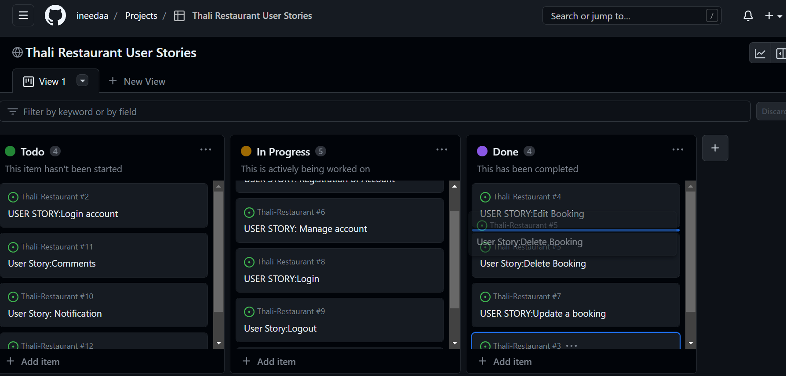

### MoSCoW Prioritization

I've decomposed my Epics into stories prior to prioritizing and implementing them.
Using this approach, I was able to apply the MoSCow prioritization and labels to my user stories within the Issues tab.

- **Must Have**: guaranteed to be delivered (*max 60% of stories*)
- **Should Have**: adds significant value, but not vital (*the rest ~20% of stories*)
- **Could Have**: has small impact if left out (*20% of stories*)
- **Won't Have**: not a priority for this iteration

## Deployment

The live deployed application can be found deployed on [Heroku](https://tahli-restaurant.herokuapp.com).

### ElephantSQL Database

This project uses [ElephantSQL](https://www.elephantsql.com) for the PostgreSQL Database.

To obtain your own Postgres Database, sign-up with your GitHub account, then follow these steps:
- Click **Create New Instance** to start a new database.
- Provide a name (this is commonly the name of the project: thalirestaurant).
- Select the **Tiny Turtle (Free)** plan.
- You can leave the **Tags** blank.
- Select the **Region** and **Data Center** closest to you.
- Once created, click on the new database name, where you can view the database URL and Password.

### Cloudinary API

This project uses the [Cloudinary API](https://cloudinary.com) to store media assets online, due to the fact that Heroku doesn't persist this type of data.

To obtain your own Cloudinary API key, create an account and log in.
- For *Primary interest*, you can choose *Programmable Media for image and video API*.
- Optional: *edit your assigned cloud name to something more memorable*.
- On your Cloudinary Dashboard, you can copy your **API Environment Variable**.
- Be sure to remove the `CLOUDINARY_URL=` as part of the API **value**; this is the **key**.

### Heroku Deployment

This project uses [Heroku](https://www.heroku.com).

Deployment steps are as follows, after account setup:

- Select **New** in the top-right corner of your Heroku Dashboard, and select **Create new app** from the dropdown menu.
- Your app name must be unique, and then choose a region closest to you (EU or USA), and finally, select **Create App**.
- From the new app **Settings**, click **Reveal Config Vars**, and set your environment variables.

### GitHub Pages
- The site was deployed to GitHub pages. The steps to deploy are as follows:
- In the GitHub repository, navigate to the Settings tab
- From the source section drop-down menu, select the Master Branch
- Once the master branch has been selected, the page will be automatically refreshed with a detailed ribbon display to indicate the successful deployment.
- The live link can be found [here.]( https://ineedaa.github.io/Thali-restaurant/)

### Gitpod 
- In GitHub repository,click on the Gitpod icon on the right hand side .
- Wait for the page to load in browser.
- In terminal,write 'python -m http.server' command.
- Click the browser button in the port 8000 that pops up.
- The page will automatically deployed in the browser.

## Credits
- Content
  - The inspiration for creating the website and content  was taken from [Thali Restaurant](https://www.thaliirestaurant.com/).
  - The django models and authentication are from stackoverflow.
  - Most of the deployment steps used in this project are inspired from Code Blog Project.
- Media
  - The photo used on this site are from [Google Images](https://www.google.com)
 
## Acknowledgements

- I would like to thank my Code Institute mentor,Rohit Sharma for his belief, support, and words of encouragement throughout the development of both this project and all my projects to date.
- I would like to thank tutor team of code institute for clarifying my doubts.
